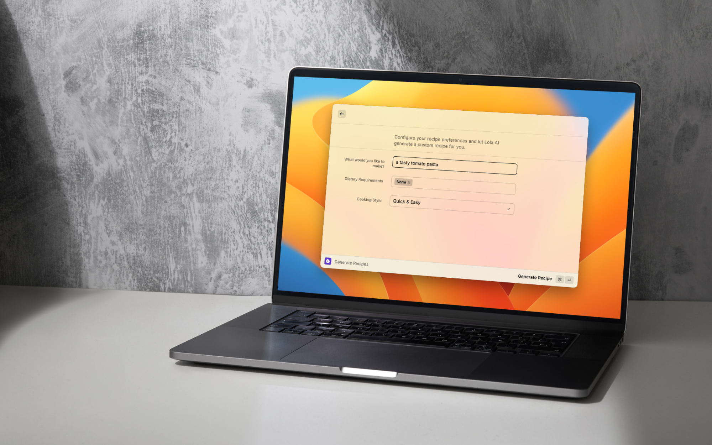

# Cookery

**AI-Powered Recipe Generation for Raycast**

Cookery is a powerful Raycast extension that uses artificial intelligence to generate delicious recipes instantly. Perfect for home cooks, food enthusiasts, and culinary professionals who want to streamline their meal planning and cooking workflow.

## ✨ Features

- **AI Recipe Generation**: Get instant, personalized recipe suggestions powered by advanced AI
- **Quick & Easy**: Generate complete recipes in under 20 seconds
- **Raycast Integration**: Seamlessly integrated into your Raycast workflow
- **Smart Suggestions**: Recipes tailored to your preferences and available ingredients
- **Meal Planning**: Plan your meals efficiently with AI-powered recommendations
- **User-Friendly**: Simple, intuitive interface designed for everyone

## 🚀 Getting Started

### Installation

1. Open Raycast on your Mac
2. Go to the Raycast Store
3. Search for "Cookery"
4. Click "Install"

Or download directly from our website: [cookeryapp.pages.dev/download.html](https://cookeryapp.pages.dev/download.html)

### Usage

1. Open Raycast (⌘ + Space)
2. Type "Cookery" or your assigned hotkey
3. Enter your ingredients or meal preferences
4. Get instant AI-generated recipes
5. Cook delicious meals!

## 📸 Screenshots

  

## 🌐 Website

Visit our official website at [cookeryapp.pages.dev](https://cookeryapp.pages.dev) for more information, documentation, and support.

### Site Structure

- **Home**: Main landing page with feature overview
- **Download**: Get the extension for Raycast
- **Support**: Comprehensive documentation and FAQs
- **Contact**: Get in touch with our team
- **Privacy Policy**: Learn how we protect your data
- **Terms & Conditions**: Understand your rights and responsibilities
- **Safety Guidelines**: Important safety information for cooking with AI-generated recipes
- **Why Sign In**: Benefits of creating a Cookery account

## 🔒 Privacy & Security

We take your privacy seriously. Your data is protected with industry-standard encryption, and we never share your personal information with third parties. Read our full [Privacy Policy](https://cookeryapp.pages.dev/privacy.html) for details.

## 📄 License

This project is licensed under the MIT License - see the LICENSE file for details.

## 🤝 Contributing

We welcome contributions! Please feel free to submit a Pull Request.

## 📞 Support

- **Documentation**: [cookeryapp.pages.dev/support.html](https://cookeryapp.pages.dev/support.html)
- **Contact Us**: [cookeryapp.pages.dev/contact.html](https://cookeryapp.pages.dev/contact.html)
- **Report Issues**: Please open an issue on GitHub

## 🌟 Star History

If you find Cookery helpful, please consider giving us a star on GitHub!

## 📱 Social Media

Follow us for updates, tips, and recipe inspiration:
- Twitter: [@CookeryApp](https://twitter.com/CookeryApp)
- Product Hunt: [Cookery](https://www.producthunt.com/posts/cookery)

## 🎉 Acknowledgments

- Thanks to all our users who provide valuable feedback
- Powered by advanced AI technology
- Built with ❤️ for the cooking community

---

**Made with ❤️ by Cookery Team**

*Taking part in [#UnpluggedForFifteen](https://unpluggedevent.pages.dev) on Saturday, July 25th, 5-5:15 BST*
